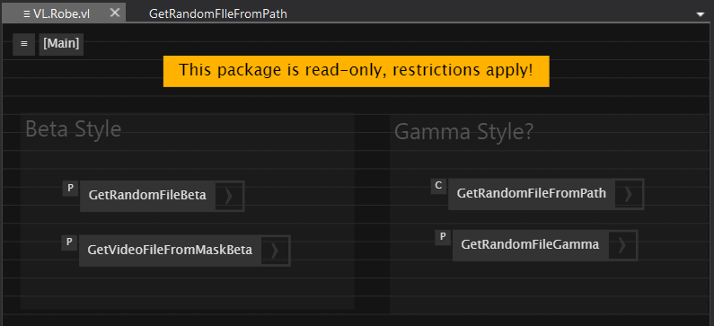
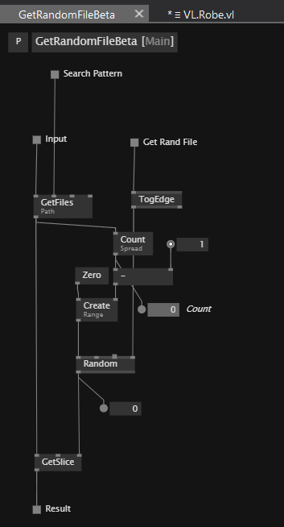
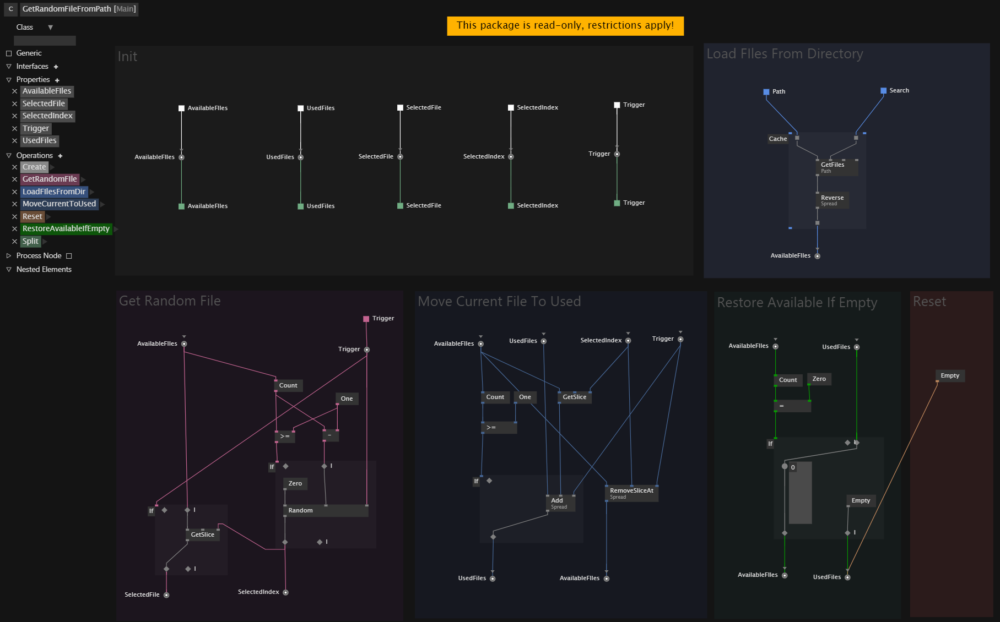

# My Learning Repository for VVVV Gamma

This repository serves as a personal exploration into learning VVVV Gamma. Please note that everything within is a work in progress and reflects my ongoing experimentation with the software. As such, I cannot guarantee the accuracy or reliability of any content.

If you are an experienced user, please check and correct if you find any mistakes, as these are purely my attempts and interpretations, and I am still figuring things out myself.

## Get Random File from a Directory

I want to create a set of definitions for VVVV Gamma that I hope to use in my future projects. I tried to recreate a simple logic in Beta(Style) and then extend it with more features in Gamma, using the new OOP paradigm.

I made a `Process` in **Beta Style** and a `Process` to manage a `Class`, trying to follow the new **Gamma Style**. (Or maybe I should say, what I suppose is the new approach in Gamma).

## VL.Robe Definitions



### Beta Style

The Beta Style is the approach I would take in VVVV Beta.



In the `Beta Style` version, the feature for non repetitive random selection is not implemented at the moment. I prefered to focus on a more advanced approach in Gamma.

Anyway, the `Random [Math]` has the 'Allow for duplicates' set it to `false`.

> Note: Ignore the other Process `GetVideoFileFromMaskBeta` which was created for a specific use case.

### Gamma Style



### My Python Reference

I used a Python script to inspire me while creating the Operations for the Class. I tried to follow the same logic and structure.

```python
class VideoPlayer:
    def __init__(self):
        self.available_files: List[str] = []
        self.used_files: List[str] = []
        self.active_videos: Dict[int, List[Dict]] = {}
        self.current_layer = 0
        self.prev_frame_time = 0
        self.curr_frame_time = 0
        self.fps = 0
        self.fps_smoothing = 0.95
        
        # Increase thread pool size based on CPU cores
        self.thread_pool = ThreadPoolExecutor(max_workers=os.cpu_count())
        
        # Pre-allocate buffers
        self.background_buffer = np.zeros((1080, 1920, 3), dtype=np.uint8)
        self.rotation_matrix = None
        self.frame_lock = Lock()
        
        self.load_video_files()

    @staticmethod
    def rotate_and_scale(frame: np.ndarray, angle: float, scale: float) -> np.ndarray:
        """Rotate and scale the frame efficiently"""
        if angle == 0 and scale == 1.0:
            return frame
            
        height, width = frame.shape[:2]
        center = (width // 2, height // 2)
        
        # Combine rotation and scaling in a single matrix
        matrix = cv2.getRotationMatrix2D(center, angle, scale)
        
        # Calculate new dimensions
        cos = np.abs(matrix[0, 0])
        sin = np.abs(matrix[0, 1])
        new_width = int((height * sin) + (width * cos))
        new_height = int((height * cos) + (width * sin))
        
        # Adjust translation
        matrix[0, 2] += (new_width / 2) - center[0]
        matrix[1, 2] += (new_height / 2) - center[1]
        
        # Use INTER_LINEAR for better performance
        return cv2.warpAffine(frame, matrix, (new_width, new_height),
                            flags=cv2.INTER_LINEAR)

    def process_video_frame(self, video_info):
        """Process a single video frame with rotation and scaling"""
        frame = video_info['buffer'].get_frame()
        if frame is not None:
            position = video_info['position']
            # Apply rotation and scaling
            frame = self.rotate_and_scale(frame, position.rotation, position.scale)
            video_info['last_frame'] = frame
            return frame, (position.x, position.y), video_info['layer']
        return video_info['last_frame'], (video_info['position'].x, video_info['position'].y), video_info['layer']

    def start_video(self, key: int, position: VideoPosition):
        if key not in self.active_videos:
            self.active_videos[key] = []
        
        if len(self.active_videos[key]) >= VIDEOS_PER_POSITION:
            oldest_video = self.active_videos[key].pop(0)
            if 'buffer' in oldest_video:
                oldest_video['buffer'].release()

        video_path = self.get_random_video()
        video_buffer = VideoBuffer(video_path)
        
        self.current_layer += 1
        new_video = {
            'buffer': video_buffer,
            'position': position,
            'layer': self.current_layer,
            'last_frame': None
        }
        self.active_videos[key].append(new_video)

    def update(self) -> np.ndarray:
        # Use numpy's optimized fill
        np.copyto(self.background_buffer, 0)
        
        # Collect all active videos
        all_videos = []
        for videos in self.active_videos.values():
            all_videos.extend((video, idx) for idx, video in enumerate(videos))
        
        # Process frames in parallel
        frame_futures = []
        for video_info, _ in sorted(all_videos, key=lambda x: x[0]['layer']):
            future = self.thread_pool.submit(self.process_video_frame, video_info)
            frame_futures.append(future)
        
        # Collect and blend frames in order
        for future in frame_futures:
            frame, position, _ = future.result()
            if frame is not None:
                self.background_buffer = fast_blend(
                    self.background_buffer, frame, position[0], position[1])

        self.calculate_fps()
        return self.draw_fps(self.background_buffer)

    def load_video_files(self):
        if os.path.exists(PATH_TO_VIDEO):
            self.available_files = [f for f in os.listdir(PATH_TO_VIDEO) 
                                  if f.endswith(('.mp4', '.avi', '.mov'))]
        if not self.available_files:
            raise Exception(f"No video files found in {PATH_TO_VIDEO}")

    def get_random_video(self) -> str:
        if not self.available_files:
            self.available_files = self.used_files
            self.used_files = []
        
        video_file = random.choice(self.available_files)
        self.available_files.remove(video_file)
        self.used_files.append(video_file)
        return os.path.join(PATH_TO_VIDEO, video_file)

    def blend_frames(self, background: np.ndarray, foreground: np.ndarray, position: Tuple[int, int]) -> np.ndarray:
        """Modified blend_frames to handle partial frame rendering"""
        x, y = position
        fg_h, fg_w = foreground.shape[:2]
        bg_h, bg_w = background.shape[:2]

        # Calculate visible region
        src_x = max(0, -x)
        src_y = max(0, -y)
        dst_x = max(0, x)
        dst_y = max(0, y)
        
        # Calculate width and height of visible region
        visible_w = min(fg_w - src_x, bg_w - dst_x)
        visible_h = min(fg_h - src_y, bg_h - dst_y)

        # Skip if no visible region
        if visible_w <= 0 or visible_h <= 0:
            return background

        # Extract visible region of foreground
        fg_visible = foreground[src_y:src_y + visible_h, src_x:src_x + visible_w]

        # Blend visible region
        if foreground.shape[2] == 4:
            alpha = fg_visible[:, :, 3:] / 255.0
            rgb = fg_visible[:, :, :3]
            roi = background[dst_y:dst_y + visible_h, dst_x:dst_x + visible_w]
            np.multiply(1 - alpha, roi, out=roi)
            np.add(roi, alpha * rgb, out=roi)
        else:
            background[dst_y:dst_y + visible_h, dst_x:dst_x + visible_w] = fg_visible

        return background

    def calculate_fps(self):
        self.curr_frame_time = time.time()
        if self.prev_frame_time == 0:
            self.prev_frame_time = self.curr_frame_time
            return
            
        inst_fps = 1 / (self.curr_frame_time - self.prev_frame_time)
        if self.fps == 0:
            self.fps = inst_fps
        else:
            self.fps = (self.fps_smoothing * self.fps + 
                       (1 - self.fps_smoothing) * inst_fps)
        self.prev_frame_time = self.curr_frame_time

    def draw_fps(self, frame: np.ndarray) -> np.ndarray:
        fps_text = f"FPS: {self.fps:.1f}"
        font = cv2.FONT_HERSHEY_SIMPLEX
        font_scale = 1
        thickness = 2
        color = (255, 255, 255)
        
        (text_width, text_height), _ = cv2.getTextSize(fps_text, font, font_scale, thickness)
        cv2.rectangle(frame, (10, 10), (20 + text_width, 20 + text_height), 
                     (0, 0, 0), -1)
        cv2.putText(frame, fps_text, (15, 15 + text_height), font, font_scale, 
                   color, thickness, cv2.LINE_AA)
        return frame

    def run(self):
```

Then, working in the Process, I adapated the logic to make it work in the Gamma context. (Pad, If Regions, etc.)


It works! I can't believe it! I am so happy! :D

Please, if you have any suggestions or corrections, let me know!
