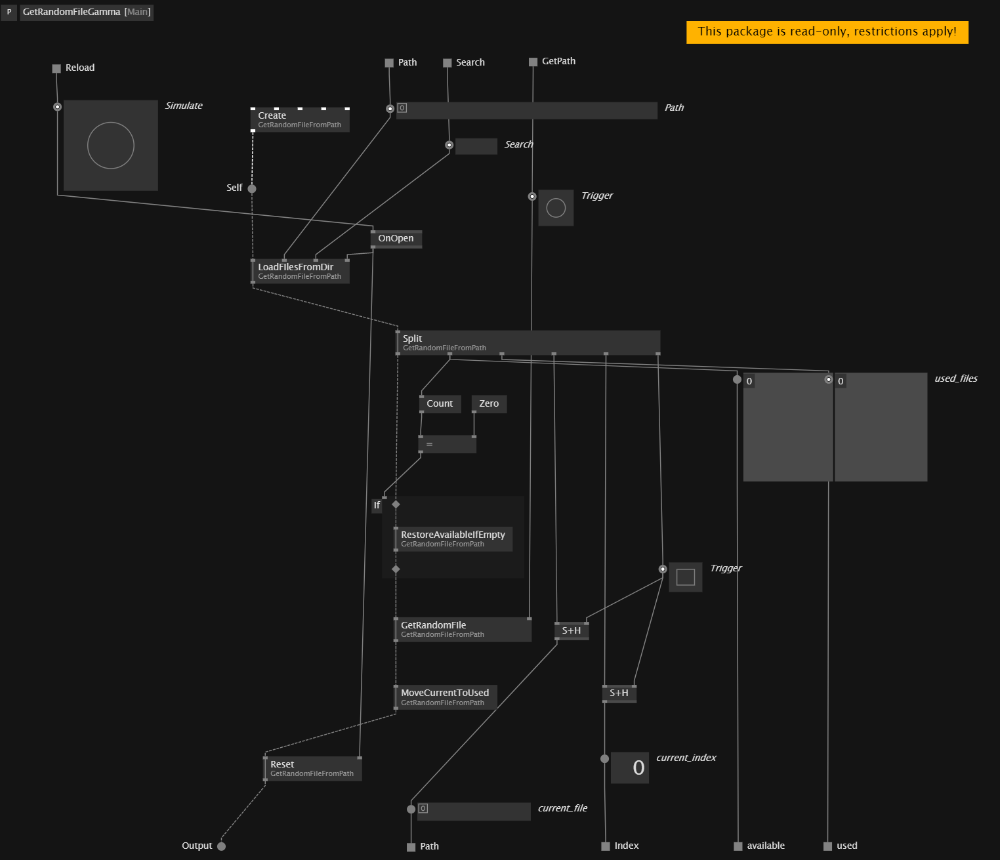

# My Learning Repository for VVVV Gamma

This repository serves as a personal exploration into learning VVVV Gamma. Please note that everything within is a work in progress and reflects my ongoing experimentation with the software. As such, I cannot guarantee the accuracy or reliability of any content.

If you are an experienced user, please check and correct if you find any mistakes, as these are purely my attempts and interpretations, and I am still figuring things out myself.

## Get Random File from a Directory

I want to create a set of definitions for VVVV Gamma that I hope to use in my future projects. I tried to recreate a simple logic in Beta(Style) and then extend it with more features in Gamma, using the new OOP paradigm.

I made a `Process` in **Beta Style** and a `Process` to manage a `Class`, trying to follow the new **Gamma Style**. (Or maybe I should say, what I suppose is the new approach in Gamma).

## VL.Robe Definitions


### Beta Style

The Beta Style is the approach I would take in VVVV Beta.


In the `Beta Style` version, the feature for non repetitive random selection is not implemented at the moment. I prefered to focus on a more advanced approach in Gamma.

Anyway, the `Random [Math]` has the 'Allow for duplicates' set it to `false`.

> Note: Ignore the other Process `GetVideoFileFromMaskBeta` which was created for a specific use case.

### Gamma Style


### My Python Reference

I used a Python script to inspire me while creating the Operations for the Class. I tried to follow the same logic and structure.

```python

```

Then, working in the Process, I adapated the logic to make it work in the Gamma context. (Pad, If Regions, etc.)



It works! I can't believe it! I am so happy! :D

Please, if you have any suggestions or corrections, let me know!
